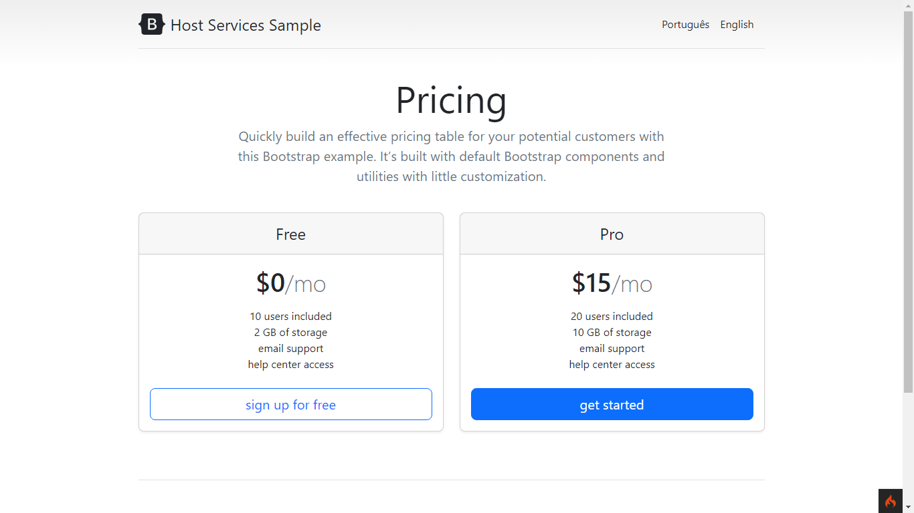

<h1 align="center"> Landing Page com seleção de idiomas com CodeIgniter Versao 1.0 </h1>

Essa landing page foi criada com o objetivo de usar os recursos de internacionalização do CodeIgniter e os componentes como Views, Controllers, Language....

  <a href="#-tecnologias">Tecnologias</a>&nbsp;&nbsp;&nbsp;|&nbsp;&nbsp;&nbsp;
  <a href="#-projeto">Projeto</a>&nbsp;&nbsp;&nbsp;|&nbsp;&nbsp;&nbsp;
  <a href="#-layout">Layout</a>&nbsp;&nbsp;&nbsp;|&nbsp;&nbsp;&nbsp;
  <a href="#memo-licença">Licença</a>

  

 

  

## 🚀 Tecnologias

Esse projeto foi desenvolvido com as seguintes tecnologias:

- PHP
- HTML
- CSS
- Bootstrap versão 5.2.2
- CodeIgniter versão 4.2.7
- Git e Github
- Spark

## 💻 Projeto

O projeto foi feito com o intuito de estudar uma melhor forma de internacionalizar um site ou landing page usando o framework PHP ColdIgniter, para implementar em diversos projetos diferentes

## :memo: Licença

Esse projeto está sob a licença MIT.

---

Feito com ♥ by Vanderlei
